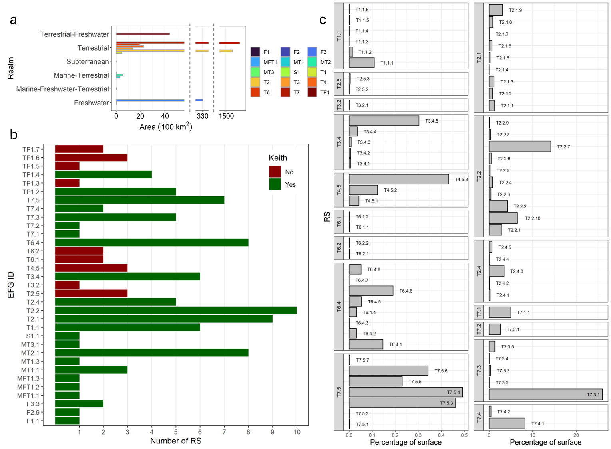

# Contact

Lea Végh  

Research Associate
Biodiversity division
National Institute for Environmental Studies (NIES, Japan)  
Email: lea.vegh@nies.go.jp 

## Research interests:

Forest ecology, Disturbance ecology, Remote sensing, Modelling, Renewable energy

# Current work

Data paper under on matching Japanese habitat categories with the international IUCN typology (under review, Ecological Research)

Link to pre-print: [https://doi.org/10.22541/au.173319062.28331883/v1](https://doi.org/10.22541/au.173319062.28331883/v1)

## High-resolution spatial dataset of ecosystem types in Japan classified within the IUCN global ecosystem typology scheme with new categories at the *Regional subgroups* level

### Abstract

The International Union for Conservation of Nature (IUCN) has recently developed a global ecosystem typology (IUCN typology) based on the functional characteristics of the ecosystems. However, its low spatial resolution and lack of recognition of certain categories in Japan limits effective and precise habitat analysis for global comparisons. In this data paper, we used the Japanese vegetation map provided by the Ministry of Environment (MOE) to align Japanese vegetation categories with the IUCN typology scheme up to Level 4, *Regional subgroups*, developing a correspondence table and a high-resolution spatial dataset focusing on terrestrial ecosystems. In addition, we also integrated the land-use classification developed by the National Institute for Environmental Studies. The dataset includes tables describing the integration of Japanese habitat classification with IUCN typology from Level 1 to 4 (*Realms, Biomes, Ecosystem functional groups, Regional subgroups*), explanation of land-use categories, and the main corresponding table as well as high-resolution integrated GIS data. This integration supports both global and local studies, with the tables including English and Japanese names of the classification tree.

  
*Japanese vegetation maps corresponding to the different IUCN levels. (a) Realms, (b) Biomes, (c) EFGs, and (d) Regional subgroups. Extent indicator of the next map is marked on each map. Detailed names for the IDs on (c, d) are shown in Table 1.  Realms IDs: F – Freshwater, FM – Freshwater-Marine, MFT – Marine-Freshwater-Terrestrial, MT – Marine-Terrestrial, S – Subterranean, T – Terrestrial, TF – Terrestrial-Freshwater, Biomes IDs: F3 – Artificial wetlands, MFT1 – Brackish tidal, MT1 – Shorelines, MT2 – Supralittoral coastal, T2 – Temperate-boreal forests and woodlands, T3 – Shrublands and shrubby woodlands, T7 – Intensive land-use, TF1 – Palustrine wetlands*

  
*Visual summary of Realms, Biomes, EFGs and Regional subgroups (RS) in Japan (Level 1-4). (a): The area of different Biomes by Realms in Japan. (b): The number of RS in each EFG, where colour indicates whether the EFG was included for Japan by Keith et al. (2023) or not. (c): The percentage of surface area of each terrestrial RS by EFGs. The name of EFG and RS IDs are shown in Table 1.*

# Selected past works

## IBFRA 2023 Conference materials

Scroll down for the poster presentation and contact information or use the side menu on the left.

## Masting in forests: a playful introduction

**Our paper related to masting was published in early 2024!**

Link to paper: [10.1016/j.ecolmodel.2023.110577](10.1016/j.ecolmodel.2023.110577)
Link to press release: [https://www.nies.go.jp/whatsnew/20240222/20240222-e.html](https://www.nies.go.jp/whatsnew/20240222/20240222-e.html)

*2023. Aug. 29.*

Here is some background information to better understand the game played during the presentation. The game borrowed elements from various studies described below, but freely modified and quantified certain parts to facilitate quick and easy flow.

### Abstract

Following the example of the European Geosciences Union’s Games Jam sessions, I intend to use a little game to introduce masting to the attendants of the session. Masting is the intermittent, irregular seed production of certain plant species, such as oaks, beech, and chestnuts in the Fagaceae family. In some years, called mast years, these species produce many seeds, while in other years they produce few or none. Although the scientific background of masting is still debated, it is influenced by the weather and the synchrony of flowering in the forest, which influence available resources for masting and pollination efficiency. Each attendant, or player, will represent an individual oak tree in the forest and in each round, or year, accumulate resources depending on the weather in that year. In each round, the players decide individually whether to use these resources for growth, for flowering, or for storage. If the players manage to coordinate their flowering efforts, the flowers will turn into acorns. However, if too much acorn is produced, the population of species living on acorns will also increase, decimating the number of healthy acorns. The aim of the game is to maintain the intensity and frequency of mast years in the forests by cooperating with other players. As climate change affects masting via changes in the start and length of the growing season, the players can try out different climate scenarios and see in which one it is the most difficult to maintain masting patterns.

  

*Typical masting pattern over the years. Yellow arrows mark mast years.*

### What drives masting?

It is still not clearly understood what drives masting and how do plants synchronize their flowering efforts over large areas. The game I created for the presentation picked elements from popular masting theories: the resource budget hypothesis, the pollen limitation hypothesis, and the predator satiation hypothesis, combined with the impact of weather when accummulating resources. Apart from oaks, which were used in the game, many other species display masting patterns (e.g. beech, chestnut, pine trees), differing in their processes and sensitivity to changes.

**Resource budget hypothesis**

According to the Resource budget hypothesis (Isagi et al. 1997), mast species only initiate flowering when their resources cross a certain threshold. When this threshold is crossed, they use the superfluous resources to invest in flowering. Fertilized flowers will develop into seeds later, using additional resources determined by the flower to fruit to ratio. After a successful mast year, the tree exhausts its resources and needs time to recover for the next masting event.

  
*Illustrating the resource budget hypothesis. Ps marks resources the tree accumulates, LT the threshold level need to be crossed, Cf and Ca the resources used for flower and acorn production, respectively.*

**Pollen limitation**

The resource budget hypothesis does not explains in itself why trees synchronize their flower production. One possible feedback process to achieve synchrony is the lack of pollen to fertilize flowers when trees does not flower together (Satake and Iwasa 2000). Synchronous flowering lowers outcross pollen limitation (Schermer et al. 2019), although weather conditions can also influence the amount of airbourne pollen.

**Predator satiation**

Many animals depend on the seeds of masting species such as rodents (Shimada and Saitoh 2006), deers (Barrere et al. 2020), boars (Touzot et al. 2020), and bears (Sato and Endo 2006). From an evolutionar perspective, masting might have been developed to keep the loss to predators low. When plants produce seeds together in large quantity, the predators cannot eat all; they will be satiated and some seeds will remain untouched. The abundance of seeds will cause the population of predators to grow, but as the next years usually have very low seed production, the number of predators will decrease again, so by the time of the next maxt year, their population is small enough not to be able to eat everything.

**Weather conditions**

In good weather conditions, the trees can produce photosynthates in optimal quantities, helping them to increase their resources for masting and everyday processes. Optimal weather conditions are often observed to preceed mast years (Drobyshev et al. 2014, Shibata et al. 2020), but there is no consensus regarding the period of importance and what constitutes good weather conditions. The game also does not include abortive weather events, commonly referred to as environmental veto (Bogdziewicz et al. 2018), or the effect of temperature difference among years preceeding masting (LaMontagne et al. 2021).

### Masting and climate change

Climate change influences the fecundity of trees (Clark et al. 2021) and masting patterns are also changing depending on the species and location. Oaks were observed to increase the frequency of mast years (Shibata et al. 2020) and produce more acorns with warmer temperatures (Nakamura et al. 2010). However, more frequent mast years cause the number of predators to be continuously high, decreasing the number of seeds which escapes predation (Bogdziewicz et al. 2020). In the version of the game we played during the presentation, the impacts of climate change were not included, but they can be added easily for future games.

### Further research

We are working to incorporate masting into a global dynamic vegetation model, called SEIB-DGVM (Sato et al. 2007). Preliminary results show that mimicking the resource budget hypothesis coupling with pollen limitation could reproduce masting characteristics of the oak (*Quercus crispula*) at our validation site. In the next steps, we will expand the model to cover first Japan, then the Northern Hemisphere. The development of the masting model is done together with Kato Tomomichi from Hokkaido University, who introduced me to the mysterieus world of masting. For more information, find my contact information at the bottom of the page.

### References-presentation

Barrere, J., Boulanger, V., Collet, C., Walker, E., Siat, V., Henry, L., Saïd, S., 2020. How does oak mast seeding affect the feeding behavior of sympatric red and roe deer? Basic Appl. Ecol. 47, 83–94. [https://doi.org/10.1016/j.baae.2020.04.006](https://doi.org/10.1016/j.baae.2020.04.006)

Bogdziewicz, M., Steele, M.A., Marino, S. and Crone, E.E. (2018), Correlated seed failure as an environmental veto to synchronize reproduction of masting plants. New Phytol, 219: 98-108. [https://doi.org/10.1111/nph.15108](https://doi.org/10.1111/nph.15108)

Bogdziewicz, M., Kelly, D., Thomas, P.A., Lageard, J.G.A., Hacket-Pain, A., 2020. Climate warming disrupts mast seeding and its fitness benefits in European beech. Nat. Plants 6, 88–94. [https://doi.org/10.1038/s41477-020-0592-8](https://doi.org/10.1038/s41477-020-0592-8)

Clark, J.S., Andrus, R., Aubry-Kientz, M., Bergeron, Y., Bogdziewicz, M., Bragg, D.C., Brockway, D., Cleavitt, N.L., Cohen, S., Courbaud, B., Daley, R., Das, A.J., Dietze, M., Fahey, T.J., Fer, I., Franklin, J.F., Gehring, C.A., Gilbert, G.S., Greenberg, C.H., Guo, Q., HilleRisLambers, J., Ibanez, I., Johnstone, J., Kilner, C.L., Knops, J., Koenig, W.D., Kunstler, G., LaMontagne, J.M., Legg, K.L., Luongo, J., Lutz, J.A., Macias, D., McIntire, E.J.B., Messaoud, Y., Moore, C.M., Moran, E., Myers, J.A., Myers, O.B., Nunez, C., Parmenter, R., Pearse, S., Pearson, S., Poulton-Kamakura, R., Ready, E., Redmond, M.D., Reid, C.D., Rodman, K.C., Scher, C.L., Schlesinger, W.H., Schwantes, A.M., Shanahan, E., Sharma, S., Steele, M.A., Stephenson, N.L., Sutton, S., Swenson, J.J., Swift, M., Veblen, T.T., Whipple, A.V., Whitham, T.G., Wion, A.P., Zhu, K., Zlotin, R., 2021. Continent-wide tree fecundity driven by indirect climate effects. Nat. Commun. 12, 1242. [https://doi.org/10.1038/s41467-020-20836-3](https://doi.org/10.1038/s41467-020-20836-3)

Drobyshev, I., Niklasson, M., Mazerolle, M.J., Bergeron, Y., 2014. Reconstruction of a 253-year long mast record of European beech reveals its association with large scale temperature variability and no long-term trend in mast frequencies. Agric. For. Meteorol. 192–193, 9–17. [https://doi.org/10.1016/j.agrformet.2014.02.010](https://doi.org/10.1016/j.agrformet.2014.02.010)

Isagi, Y., Sugimura, K., Sumida, A., Ito, H., 1997. How Does Masting Happen and Synchronize? J. Theor. Biol. 187, 231–239. [https://doi.org/10.1006/jtbi.1997.0442](https://doi.org/10.1006/jtbi.1997.0442)

LaMontagne, J.M., Redmond, M.D., Wion, A.P., Greene, D.F., 2021. An assessment of temporal variability in mast seeding of North American Pinaceae. Philos. Trans. R. Soc. B Biol. Sci. 376, 20200373. [https://doi.org/10.1098/rstb.2020.0373](https://doi.org/10.1098/rstb.2020.0373)

Nakamura, M., Muller, O., Tayanagi, S., Nakaji, T., Hiura, T., 2010. Experimental branch warming alters tall tree leaf phenology and acorn production. Agric. For. Meteorol. 150, 1026–1029. [https://doi.org/10.1016/j.agrformet.2010.04.001](https://doi.org/10.1016/j.agrformet.2010.04.001)

Pearse, I.S., Koenig, W.D., Kelly, D., 2016. Mechanisms of mast seeding: resources, weather, cues, and selection. New Phytol. 212, 546–562. [https://doi.org/10.1111/nph.14114](https://doi.org/10.1111/nph.14114)

Satake, A., Iwasa, Y., 2000. Pollen Coupling of Forest Trees: Forming Synchronized and Periodic Reproduction out of Chaos. J. Theor. Biol. 203, 63–84. [https://doi.org/10.1006/jtbi.1999.1066](https://doi.org/10.1006/jtbi.1999.1066)

Sato, Y., Endo, M., 2006. Relationship between crop use by brown bears and Quercus crispula acorn production in Furano, central Hokkaido, Japan. Mammal Study 31, 93–104. [https://doi.org/10.3106/1348-6160(2006)31[93:RBCUBB]2.0.CO;2](https://doi.org/10.3106/1348-6160(2006)31[93:RBCUBB]2.0.CO;2)

Sato H., Itoh A., Kohyama T., 2007. SEIB-DGVM: A New Dynamic Global Vegetation Model using a Spatially Explicit Individual-Based Approach. Ecol. Modell. 200(3-4), 279-307. [https://doi.org/10.1016/j.ecolmodel.2006.09.006](https://doi.org/10.1016/j.ecolmodel.2006.09.006)

Schermer, É., Bel-Venner, M.-C., Fouchet, D., Siberchicot, A., Boulanger, V., Caignard, T., Thibaudon, M., Oliver, G., Nicolas, M., Gaillard, J.-M., Delzon, S., Venner, S., 2019. Pollen limitation as a main driver of fruiting dynamics in oak populations. Ecol. Lett. 22, 98–107. [https://doi.org/10.1111/ele.13171](https://doi.org/10.1111/ele.13171)

Shibata, M., Masaki, T., Yagihashi, T., Shimada, T., Saitoh, T., 2020. Decadal changes in masting behaviour of oak trees with rising temperature. J. Ecol. 108, 1088–1100. [https://doi.org/10.1111/1365-2745.13337](https://doi.org/10.1111/1365-2745.13337)

Shimada, T., Saitoh, T., 2006. Re-evaluation of the relationship between rodent populations and acorn masting: a review from the aspect of nutrients and defensive chemicals in acorns. Popul. Ecol. 48, 341–352. [https://doi.org/10.1007/s10144-006-0012-6](https://doi.org/10.1007/s10144-006-0012-6)

Touzot, L., Schermer, É., Venner, S., Delzon, S., Rousset, C., Baubet, É., Gaillard, J.-M., Gamelon, M., 2020. How does increasing mast seeding frequency affect population dynamics of seed consumers? Wild boar as a case study. Ecol. Appl. 30, [https://doi.org/10.1002/eap.2134](https://doi.org/10.1002/eap.2134)

## Recovery after large scale disturbances: the power of vegetation patches

*2023. Aug. 30.*

Abstract, Poster, and References

### Abstract

Large scale disturbances, such as volcanic eruptions and open mining operations, often completely erase the vegetation cover and destroy soil communities, prompting primary succession. Primary succession is a slow process, and many years are needed until the vegetation grows strong enough to prevent landslides or flash floods from runoff precipitation. To reduce the risks of such events, active interventions, such as revegetation by planting trees in critical areas, can accelerate the development of vegetation cover. However, these artificial plantations might foster different plant communities and species diversities compared to naturally recovered forests, resulting in long-term negative impacts in exchange for short-term positive ones. Is there a better approach which maximizes recovery speed but retains advantages of natural succession? By investigating vegetation patch dynamics and comparing plant species diversities and communities among several forest types after volcanic eruptions, I propose that planting trees and shrubs in patches near each other fosters quick recovery and native species composition. Observations at the volcano Mount Usu (Hokkaido, Japan), showed that in the early stages of recovery, natural vegetation patches expanded faster and had denser vegetation if they were clustered close to each other. Similarly, plantations with patch-like design encouraged the establishment of native species, by protecting fresh recruits from the harsh environment in the open spaces between the planted trees, resulting in higher species diversity and native species composition. Although the planted tree species changed canopy composition compared to natural forests, the understorey layer trended toward natural species compositions if appropriate species were selected during the planting phase. In summary, if quick recovery is desired after large scale disturbances, spatially heterogeneous, patchy planting design are better than dense, homogeneous plantations in reaching natural species compositions and diversities.

### Poster

### References-poster

Végh, L, Tsuyuzaki, S. 2021 Comparison of vegetation patch dynamics after the eruptions of the volcano Mount Usu, northern Japan, in 1977–1978 and 2000, detected by imagery chronosequence. Ecological Research. 1– 11. [https://doi.org/10.1111/1440-1703.12199](https://doi.org/10.1111/1440-1703.12199)

Végh, L, Tsuyuzaki, S. 2022 Differences in canopy and understorey diversities after the eruptions of Mount Usu, northern Japan — Impacts of early forest management. Forest Ecology and management. 510. [https://doi.org/10.1016/j.foreco.2022.120106](https://doi.org/10.1016/j.foreco.2022.120106)

### Acknowledgements

I wish to thank my supervisor, Tsuyuzaki Shiro from Hokkaido University, for his help and comments during the study.

 

  
